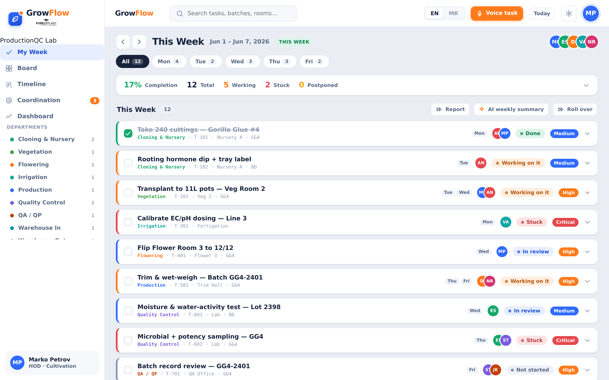
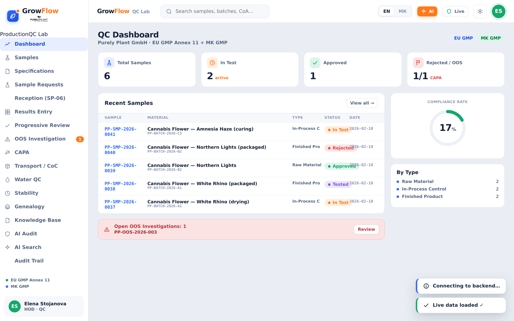
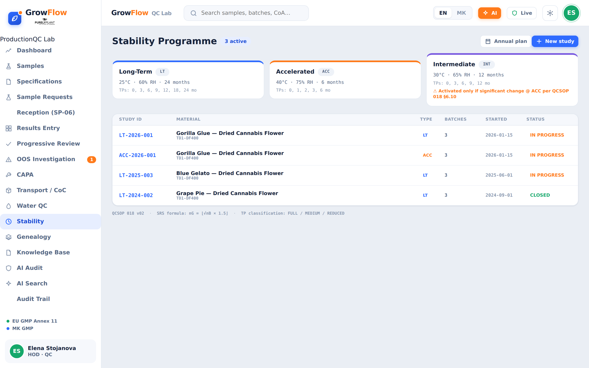
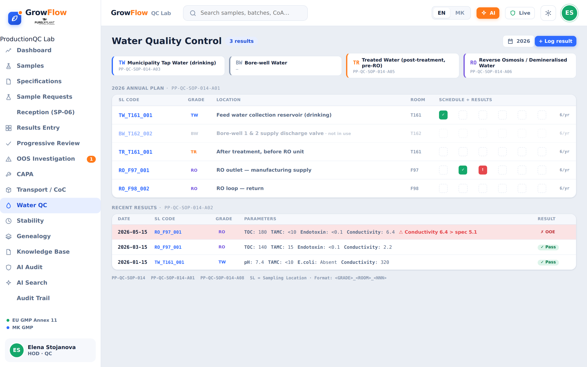
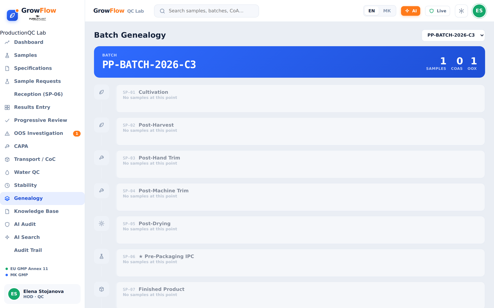
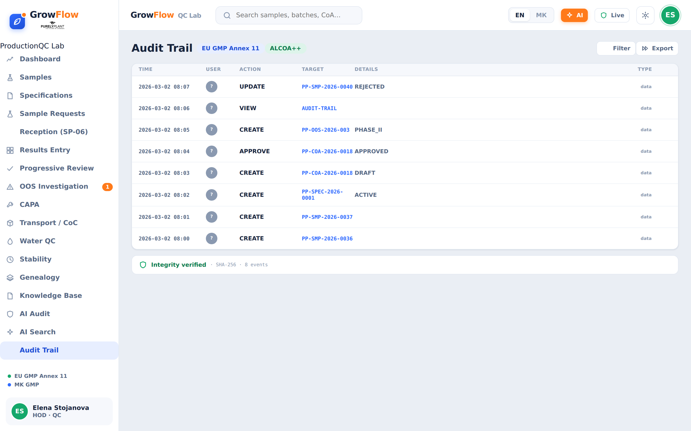

# GrowFlow Unified — Frontend (React + Vite)

The GrowFlow Unified SPA. One shell, two modes (**Production** and **QC Lab**),
bilingual EN/МК. Rebuilt from the Claude Design HTML/CSS/JS prototype: the
prototype's pixel-perfect stylesheet is reused verbatim, the logic is rebuilt as
React components.

## Structure

```
frontend/
  index.html              Vite entry
  vite.config.js          dev server + API proxy to the backend
  nginx.conf              production: serve build + proxy /api → backend
  Dockerfile              multi-stage (node build → nginx)
  src/
    main.jsx              mounts <App>, imports app.css + brand.css
    App.jsx               shell: sidebar, header, mode switch, settings + login
    styles/app.css        design tokens + all component styles (reused verbatim)
    styles/brand.css      Purely Plant logo crops
    assets/pp-logos.svg
    api/client.js         fetch client + JWT (auth, samples, specs, coa, oos, audit)
    lib/                  icons.jsx, ui.jsx (Avatar/Modal/Toast), i18n.js, style.js
    production/           Production module (data, useProduction hook, TaskCard,
                          ProductionWorkspace, labels)
    qc/                   QC Lab module (data, useQC hook, QcModule views)
```

## Backend API contract

The QC Lab loads live data through `src/api/client.js` (relative paths; nginx /
the Vite proxy forwards to FastAPI):

| UI | Endpoint |
| --- | --- |
| Login | `POST /auth/login` `{email,password}` → `{access_token,user}` |
| Samples | `GET /samples`, `GET /samples/{id}` |
| Specifications | `GET /specifications` |
| Certificate of Analysis | `GET /coa`, `POST /coa/{id}/sign` |
| OOS investigations | `GET /oos` |
| Audit trail | `GET /audit` |

**Offline-first.** With no backend URL set, the app runs entirely on bundled seed
data in `localStorage` — fully interactive. Set the URL in **Settings** and sign
in (header **Log in**) to load live records; failures fall back to local data.

## Scripts

```bash
npm install
npm run dev      # http://localhost:5173 (proxies API to http://localhost:8000)
npm run build    # → dist/
npm run preview  # serve the production build locally
```

## QC Lab screens

The QC Lab module ports the full prototype nav, all wired into `QcModule.jsx`:
Dashboard, Samples (+ detail/CoA), **Specifications** (+ detail), **Sample
Requests (RQS)**, Reception (SP-06), Results Entry, **Progressive Review**, OOS
Investigation (+ detail), **CAPA**, **Transport / CoC**, **Water QC**,
**Stability** (programme + study detail + A08/A09/A10 forms), **Genealogy**,
**Knowledge Base**, AI Search and the Annex 11 Audit Trail. Each screen lives in
`src/qc/screens/` and takes `{ qc, lang, labels, onToast }`.

## Screenshots

Captured from the running build via `node scripts/screenshot.mjs` (headless
Chromium). Stored in `docs/screenshots/`.

| Production board | QC Dashboard |
| --- | --- |
|  |  |

| Stability programme | Water QC plan |
| --- | --- |
|  |  |

| Genealogy | Audit trail (Annex 11) |
| --- | --- |
|  |  |

Regenerate: `npm run preview &` then `node scripts/screenshot.mjs http://127.0.0.1:4173 docs/screenshots`.

## Notes for maintainers

- The reused `src/styles/app.css` is the source of truth for visual style; design
  tokens (colors, spacing, shadows, radii) are CSS custom properties at its top.
- QC screens preserve the prototype's bespoke inline grid layouts via the
  `css()` string→object helper (`src/lib/style.js`) — load-bearing for pixel
  parity; keep them rather than normalizing.
- Each QC screen manages its own detail/sub-view selection with local
  `useState`, so the router (`QcWorkspace`) needs only one route per screen.
