# Architecture Diagrams - Cannabis EU GMP QMS Creator

**Document Version**: 1.0
**Date**: 2026-01-30

---

## Diagram 1: High-Level System Architecture

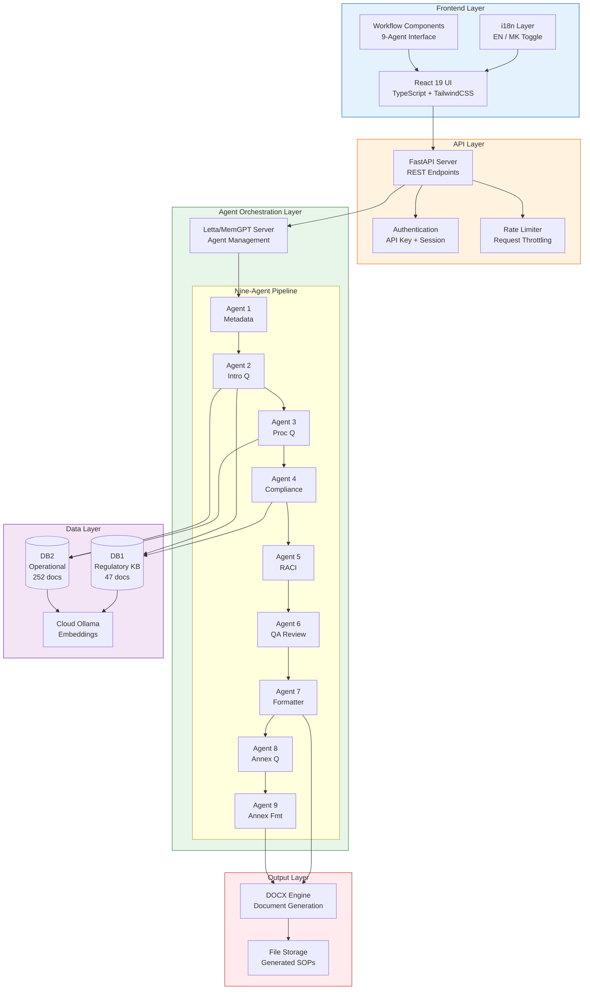

---

## Diagram 2: Complete Process Flow

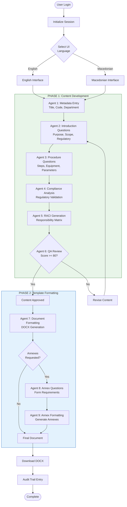

---

## Diagram 3: Agent Ecosystem - Internal Workflows

### 3A: Content Development Agents

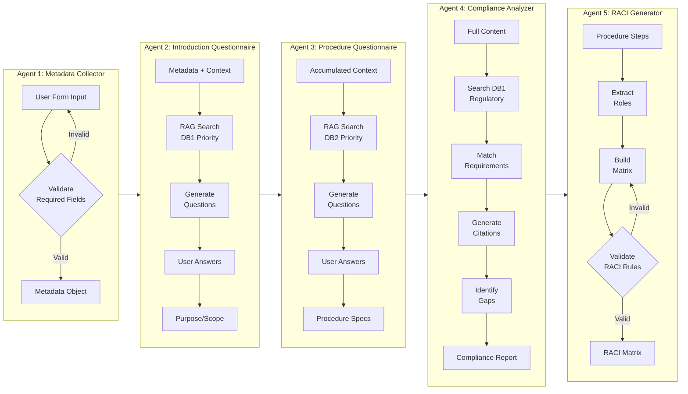

### 3B: Quality and Formatting Agents

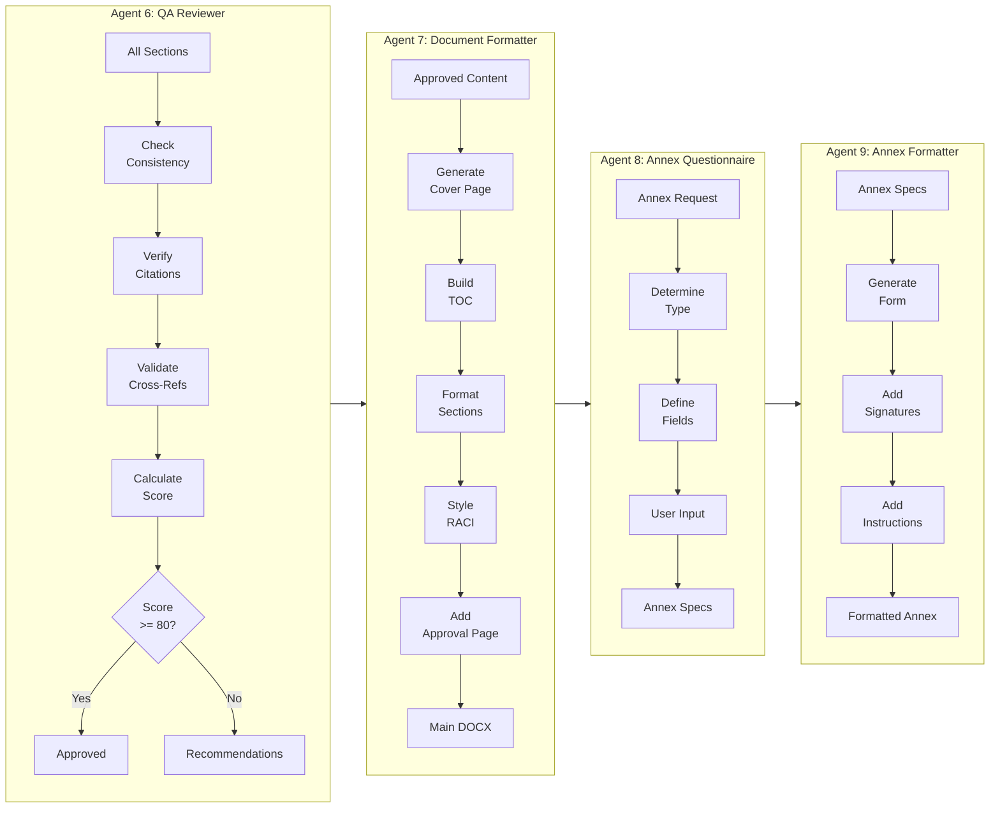

### 3C: Agent Interconnectivity Map

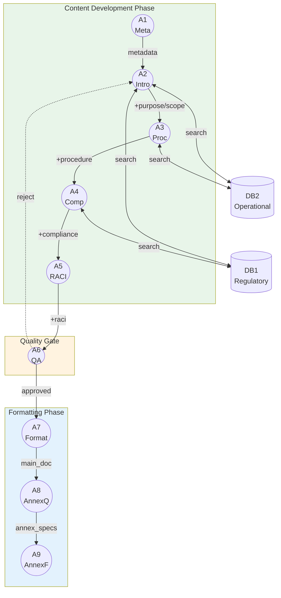

---

## Diagram 4: Database Architecture

### 4A: DB1 Entity-Relationship Diagram

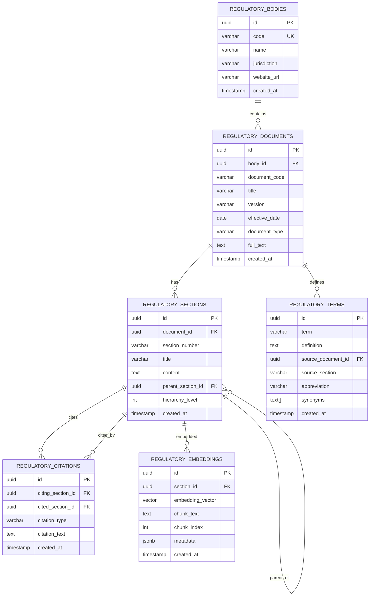

### 4B: DB2 Entity-Relationship Diagram

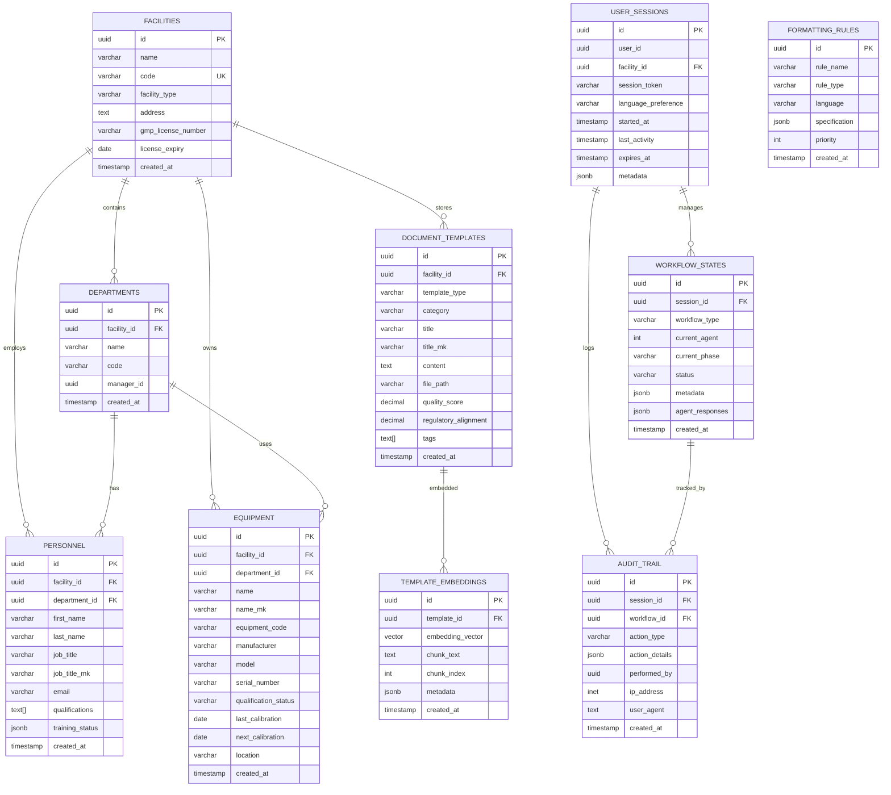

### 4C: Database Interaction Flow

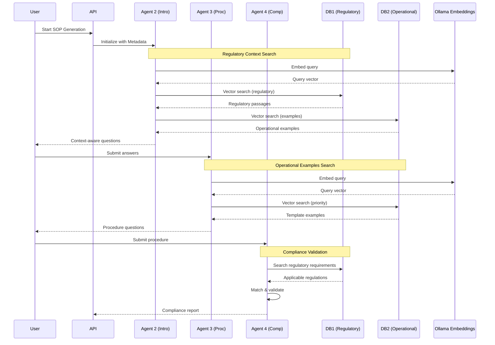

---

## Diagram 5: Quality Assurance & Validation Workflow

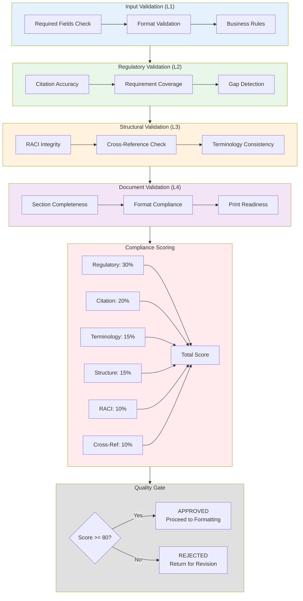

---

## Diagram 6: User Interface Journey Map

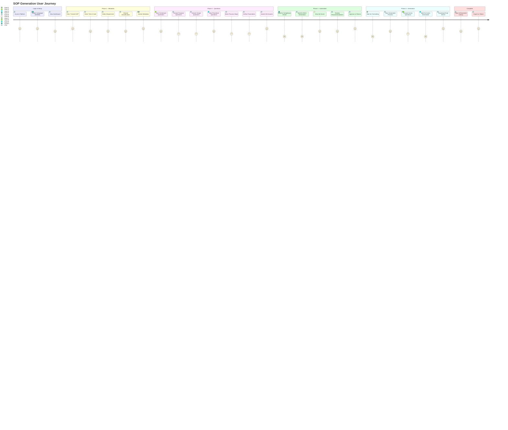

### UI State Flow Diagram

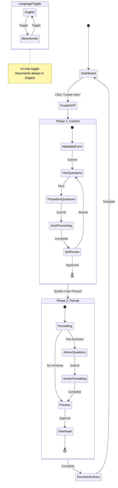

---

## Color Scheme Reference

| Component | Color | Hex Code |
|-----------|-------|----------|
| Frontend Layer | Light Blue | #E3F2FD |
| API Layer | Light Orange | #FFF3E0 |
| Orchestration Layer | Light Green | #E8F5E9 |
| Storage Layer | Light Purple | #F3E5F5 |
| Output Layer | Light Red | #FFEBEE |
| Primary Accent | Purely Plant Blue | #1F4E79 |
| Secondary Accent | Purely Plant Green | #538135 |
| Neutral | Gray | #404040 |

---

*Generated for Cannabis EU GMP QMS Creator*
*Document Version: 1.0*
